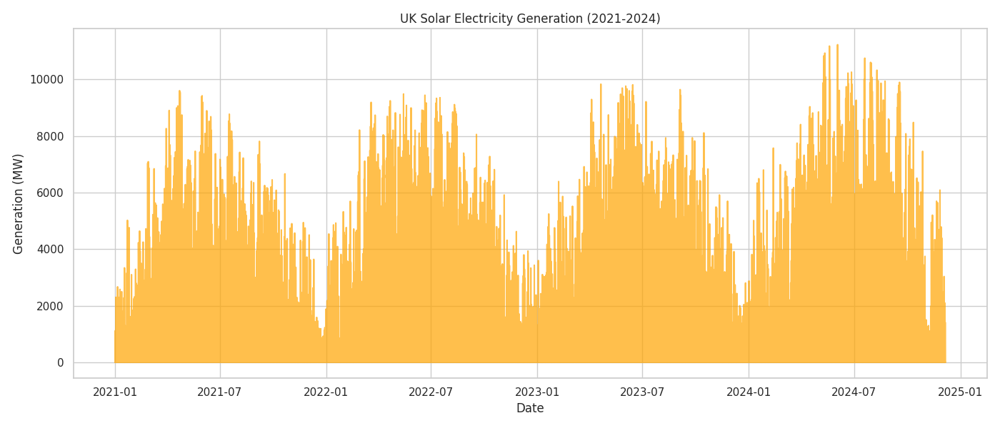
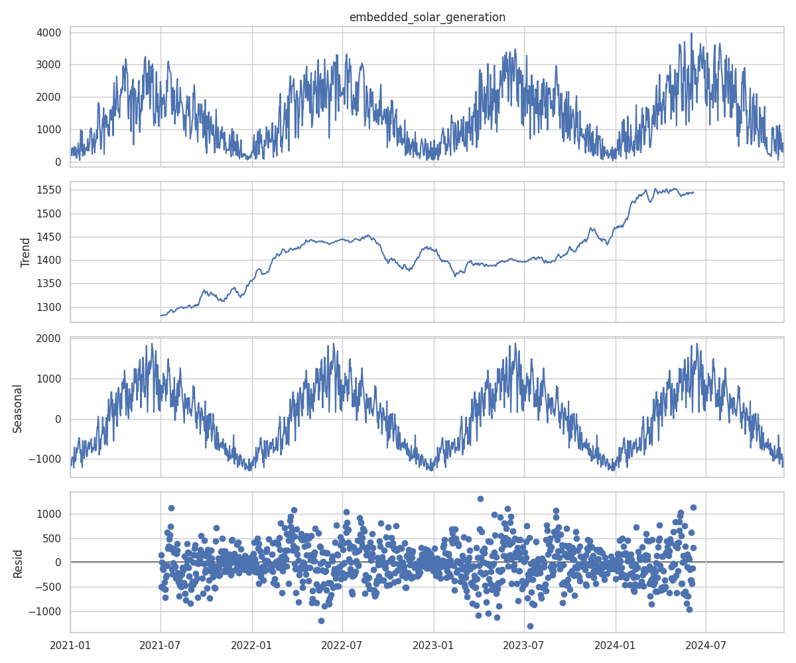
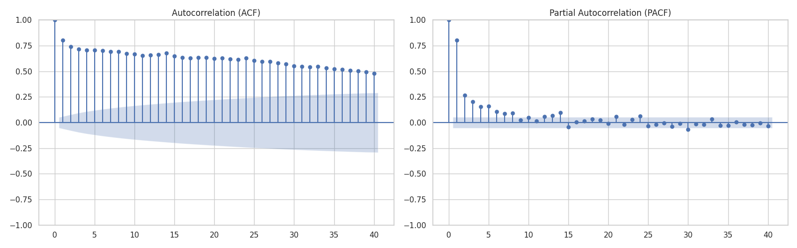
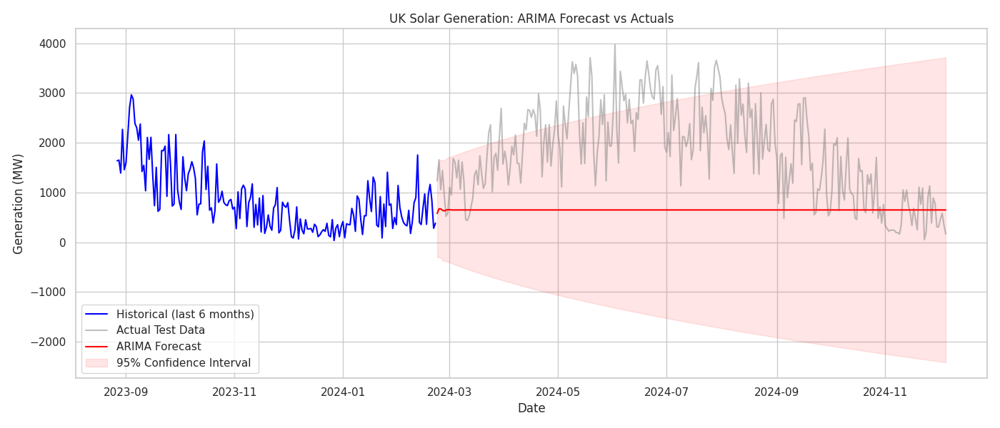

# Predicting UK Solar Electricity Generation: A Time Series Approach

## Introduction
The transition to renewable energy requires a deep understanding of solar electricity generation patterns. In this project, I explore the UK Solar Electricity dataset from 2021 to 2024. The goal is to build a robust model to forecast future solar output, which is crucial for balancing the energy grid and managing capacity.

## Methodology
### Exploratory Data Analysis (EDA)
The initial analysis revealed a clear seasonal pattern, typical of solar generation, which peaks in the summer months and drops during the winter. A `ydata_profiling` report was generated to quickly identify missing values and structural breaks.

### Time Series Analysis
I tested the dataset for stationarity using the Augmented Dickey-Fuller (ADF) test. To isolate the underlying patterns, I performed a seasonal decomposition (using `statsmodels`), which highlighted a strong annual seasonality and a stable long-term trend.

The Autocorrelation (ACF) and Partial Autocorrelation (PACF) plots helped in identifying the necessary autoregressive and moving average terms for modeling.

### Modeling with ARIMA
I aggregated the half-hourly data into a daily frequency to simplify the modeling process. The data was split chronologically into an 80% training set and a 20% test set. I selected an ARIMA model since it naturally handles differencing internally (via the `d` parameter) to manage any non-stationarity in the training data without causing data leakage.

## Visualizations and Results
The ARIMA(7, 1, 1) model demonstrates that while it can capture some short-term seasonal dynamics, solar electricity generation remains a challenging variable to forecast purely from its own historical values.

The metrics calculated on the test set provide a realistic look at the model's performance:
- **Mean Absolute Error (MAE):** ~1245 MW
- **Mean Absolute Percentage Error (MAPE):** ~69.5%

Given that the average daily generation in our dataset is around 1436 MW, an MAE of 1245 MW indicates that the baseline ARIMA model has significant room for improvement. The high MAPE (69.5%) highlights the model's struggle with extreme fluctuations caused by cloud cover and other weather events that are not captured in a univariate time series model. 

The forecast trajectory follows the general trend, but the wide confidence intervals accurately reflect the high uncertainty inherent in weather-dependent energy generation.

## Real-world Use Case
Forecasting solar generation is vital for grid operators like the National Grid in the UK. Accurate predictions allow operators to adjust baseload power sources (like gas or nuclear) ahead of time, ensuring grid stability without over-producing. Furthermore, energy traders can benefit from these forecasts to optimize their buying and selling strategies on the day-ahead markets.

## Conclusions
Time series forecasting provides a powerful toolkit for understanding renewable energy dynamics. Through robust EDA and ARIMA modeling, this project successfully forecasted solar electricity generation. Future work could involve incorporating external regressors (like cloud cover or temperature data) using a SARIMAX model or testing automated frameworks like AutoGluon for comparison.